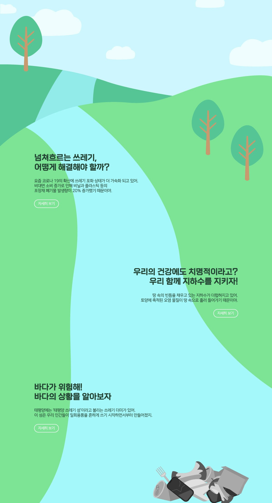
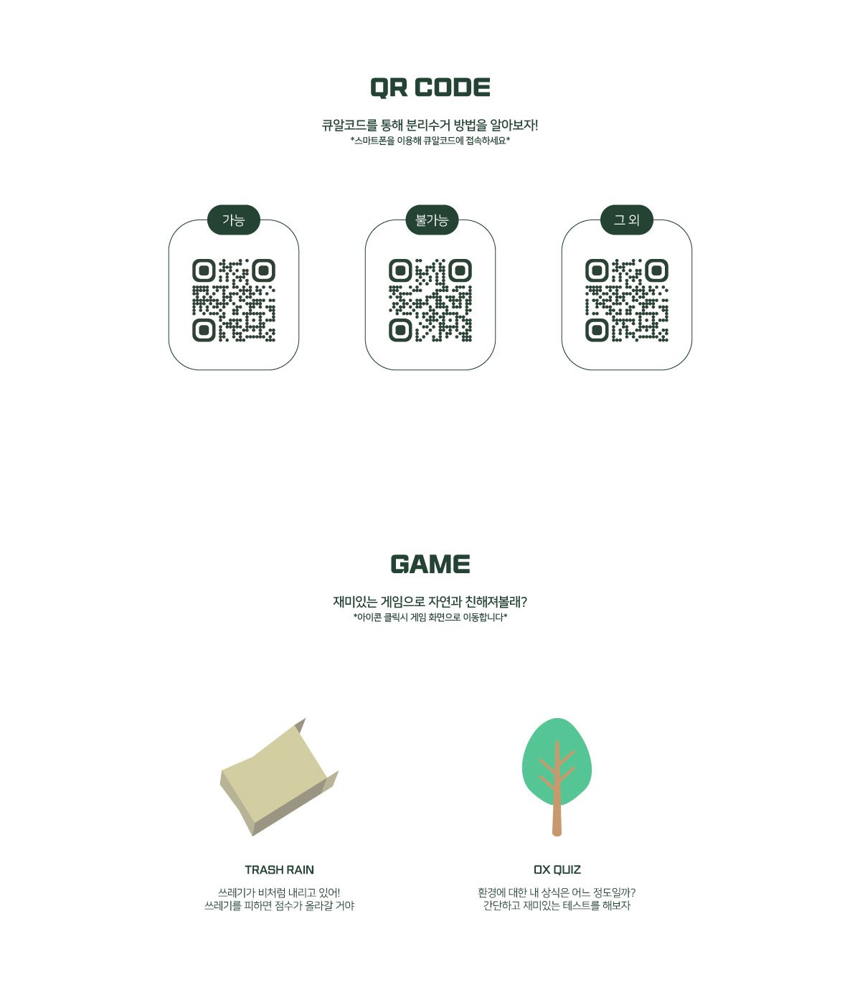
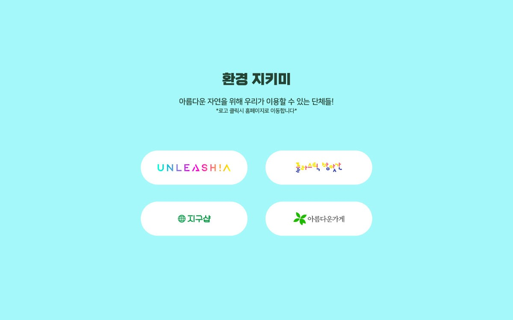

# :seedling: MakeUrDay :seedling:
환경오염 스토리 및 QR코드 인식시 분리배출 방법 제공하는 웹사이트

## Outline
미림여자정보과학고등학교 전공동아리 앱앤미는 “Maker에서 User로”라는 신조에 맞추어 여러 프로젝트를 진행해왔습니다. “Make Ur Day”은 진행되는 이야기를 통해서 재활용의 필요성에 대한 의식을 심고 종류별로 재활용하는 방법이 담긴 큐알코드를 제공하는 웹사이트 입니다.

## 화면
#### :green_heart: 메인화면 :green_heart:

--------------------------------

#### :iphone: QR코드 및 GAME :iphone:

--------------------------------

#### :open_hands: 환경단체 사이트 제공 :open_hands:

--------------------------------
### :computer: 호스팅 주소 :computer:
https://areyh817.github.io/Make_Ur_Day/

## MEMBER
--------------------------------
* **김하늘** : Full Stack Development
* **윤채원** : Full Stack Development
* **오윤서** : Full Stack Development
* **조혜라** : Full Stack Development
* **이은서** : Desing
* **조하빈** : Desing